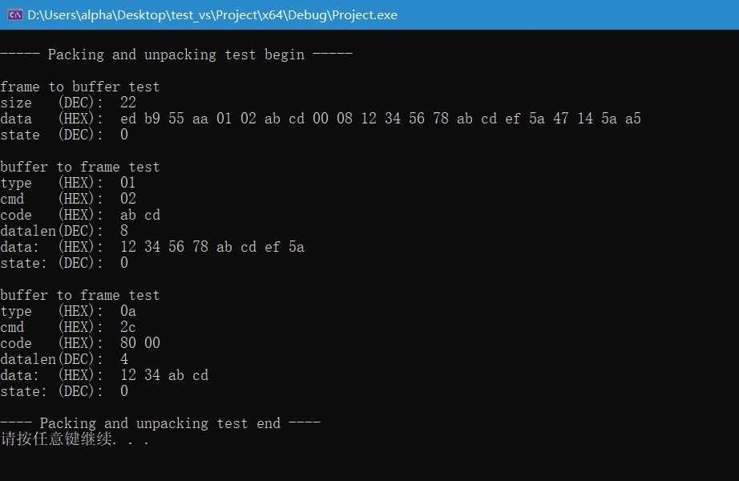

# Protocol

一个简洁实用的自定义通信协议。

|    说明    | 帧头 | 设备 ID | 指令码 | 功能码 | 数据长度 | 数据(存储区) | 校验值 | 帧尾 |
| :--------: | :--: | :-----: | :----: | :----: | :------: | :----------: | :----: | :--: |
|  变量命名  | head |  type   |  cmd   |  code  | datalen  |     data     | chkval | tail |
| 长度(Byte) |  4   |    1    |   1    |   2    |    2     |      n       |   2    |  2   |

数据存储区最大长度，单位为`字节`。

```c
#define MSG_FRAME_MAX_LEN   64
```

可处理有效数据最大长度，单位为`字节`。

```c
#define MSG_BUF_MAX_LEN     96
```

帧头：有效数据的开始。

```c

#define MSG_FRAME_HEAD0     0xED
#define MSG_FRAME_HEAD1     0xB9
#define MSG_FRAME_HEAD2     0x55
#define MSG_FRAME_HEAD3     0xAA
```

设备 ID：设备种类、地址或者设备类型

```c
uint8_t type;
```

指令码：对设备的造作命令，如 open、close、read、write 等。

```c
uint8_t cmd;
```

功能码：对指令码的进一步说明。

```c
uint16_t code;
```

数据长度：数据存储区中`数据`的长度，单位为`字节`。

```c
uint16_t datalen;
```

数据存储区：用来存储要传输的数据。

```c
uint8_t data[MSG_FRAME_MAX_LEN];
```

校验值：基于 CRC 校验(可自定义)。

```c
static uint16_t mc_check_crc16(const uint8_t *data, uint8_t len)
{
    uint16_t crc16 = 0xffff;
    uint8_t state, i, j;
    for(i = 0; i < len; i++ )
    {
        crc16 ^= data[i];
        for( j = 0; j < 8; j++)
        {
            state = crc16 & 0x01;
            crc16 >>= 1;
            if(state)
            {
                crc16 ^= 0xa001;
            }
        }
    }
    return crc16;
}
```

帧尾：有效数据的结束。

```c
#define MSG_FRAME_TAil0     0x5A
#define MSG_FRAME_TAil1     0xA5
```

# 测试验证

测试环境：Visual Studio 2022 IDE

运行结果：


